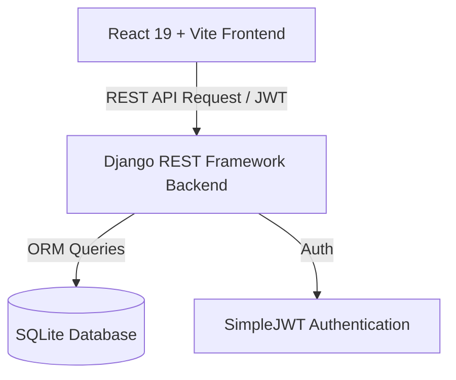

# 🏗️ Nexus Tech Store System Architecture

## Overview

**Nexus Tech Store** is a full-stack e-commerce web application featuring a React single-page frontend decoupled from a Django REST Framework backend service.

## System Components

1. **Frontend Client (`/frontend`)**:
   - Built with React 19, Vite, and Tailwind CSS v4.
   - Global Context providers: `AuthContext`, `CartContext`, `LenisContext`.
   - Dynamic canvas video scrubbing and glassmorphism design system.

2. **Backend API (`/backend`)**:
   - Powered by Django REST Framework.
   - Modular models for User, Category, Product, Order, and Review management.
   - Role-based permissions separating customer operations from administrative controls.

3. **Data Schema**:
   - `User`: Custom user model with `role` attribute (`customer`, `admin`).
   - `Category` & `Product`: Relational inventory with JSON spec objects.
   - `Order` & `OrderItem`: Order historical snapshot tracking.
