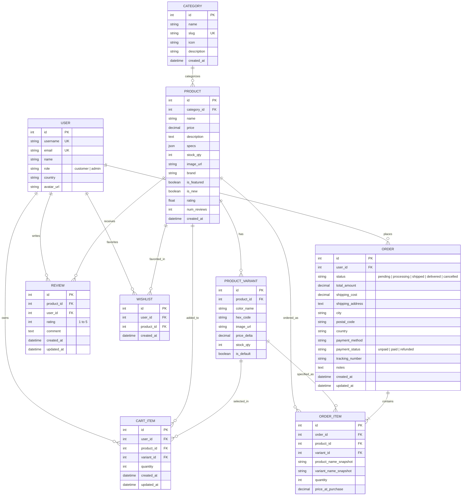

# 🗄️ Nexus Tech Store - Database Architecture & Schema Specification

This document details the relational database design, table relationships, foreign key constraints, and indexing strategies for the **Nexus Tech Store** Django REST Framework backend.

---

## 📊 Entity Relationship Diagram (ERD)

---

## 🔑 Key Invariants & Safeguards

1. **Snapshot Pricing & Naming**:
   - `OrderItem` preserves `price_at_purchase`, `product_name_snapshot`, and `variant_name_snapshot` at the exact checkout timestamp, making past invoices immutable to future product price adjustments.

2. **Automated Rating Re-aggregation**:
   - Creating, modifying, or deleting a `Review` automatically triggers `Product.update_rating()` to compute real-time average stars and total count.

3. **Compound Unique Constraints**:
   - `Review`: `unique_together = ('product', 'user')` - prevents duplicate reviews from the same account.
   - `Wishlist`: `unique_together = ('user', 'product')` - avoids redundant bookmarking.
